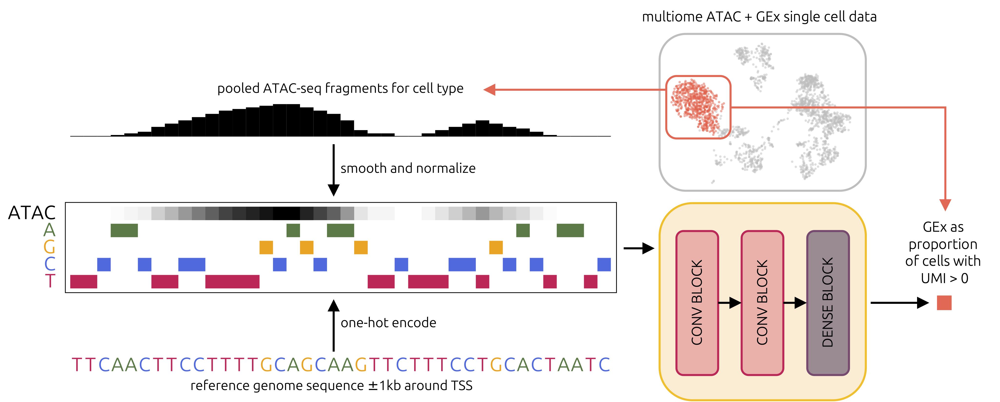

# Sequence-to-expression modelling with chromatin accessibility

This repository demonstrates the implementation of a chromatin accessibility-augmented sequence-to-expression model using pooled RNA- and ATAC-seq data from human single cell multiome datasets.

## Contents

+ [Overview](#overview)
+ [Download](#download)
+ [Dependencies](#dependencies)
+ [Sample data and trained models](#sample-data-and-trained-models)
+ [1. Model training](#1-model-training)
+ [2. Model evaluation](#2-model-evaluation)
+ [3. Model explanation](#3-model-explanation)
+ [Notes](#notes)

## Overview

Each input example consists of 5 vectors of length 2000, representing the promoter of a gene in a specific cell type. A pooled ATAC-seq track accompanies the one-hot encoded DNA nucleotides of the promoter sequence. For each input example, the convolutional neural network (largely based on Xpresso by Agarwal et al., 2020) outputs a single value that represents the proportion of cells expressing the input gene.

The provided Python programs can be used to reproduce the analyses in the manuscript titled *Refining sequence-to-expression modelling with chromatin accessibility* by Orsolya Lapohos, Gregory Fonseca, and Amin Emad (under review). These analyses include the ablation and scrambling experiments, as well as model explanation.

## Download

This repository may be downloaded using:

    git clone https://github.com/lapohosorsolya/accessible_seq2exp

## Dependencies

This repository was written and tested with Python 3.8.18. All dependencies are indicated in the `requirements.txt` file. To create a conda environment with the same Python version and dependencies, please enter the repository directory and run: 

    conda create --name accessible_seq2exp --file requirements.txt

Then, to run the Python programs described below in this environment, use the following command line template:

    conda run -n accessible_seq2exp python <program_name>.py ...

## Sample data and trained models

Sample training and testing data, as well as trained DNA-only and DNA+ATAC models for CD4 T cells can be accessed via figshare:

| Dataset | URL |
| ------ | ----- |
| Pre-processed CD4 T cell (sc) train and test sets (5-fold CV) | https://doi.org/10.6084/m9.figshare.26426404.v1 |
| Trained CD4 T cell (sc) DNA-only models | https://doi.org/10.6084/m9.figshare.26434000.v1 |
| Trained CD4 T cell (sc) DNA+ATAC models | https://doi.org/10.6084/m9.figshare.26436391.v1 |

The data files are provided in NumPy archive format, each containing arrays named 'samples' (Ensembl gene IDs), 'promoter' (2kb sequence around the TSS), 'rna' (gene expression probabilities in cell type), and 'atac' (pooled ATAC-seq tracks aligned to sequences).

## 1. Model training

### Input

To train the model (5-fold CV with 5 different random seeds each), run `1_train_model_cv.py` from the command line. 

The following parameters are **required**:

- `-m` (model name): the name of the model to train (AugmentedSeq2Exp)
- `-i` (input directory): the full path to the directory containing the training and testing sets for 5-fold CV
- `-o` (output directory): the directory where the output should be written (will make this directory if it does not exist yet)
- `-g` (gpu id): the integer corresponding to the GPU via CUDA

The following parameters are *optional*:
- `-s` (settings): path to JSON file with model settings and hyperparameters (overrides defaults); example provided in example/settings.json, and settings modifiable by the JSON file are listed below:
    - `include_dna` may be `true` (default) or `false` (ablates the model to use only ATAC feature)
    - `include_atac` may be `true` (default) or `false` (ablates the model to use only DNA feature)
    - `shuffle_mode` may be set to any one of the following, if both `include_dna` and `include_atac` are true
        - `none` (default): no shuffling
        - `dna`: shuffle the input DNA sequences w.r.t. the target genes and input ATAC tracks
        - `atac`: shuffle the input ATAC tracks w.r.t. the target genes and input DNA sequences
        - `pairwise`: shuffle both input DNA sequences and ATAC tracks w.r.t. the target genes
        - `separate`: shuffle the input DNA sequences and ATAC tracks, independently, w.r.t. the target genes
    - `batch_size` should be an integer (default = 512)
    - `max_epochs` should be an integer (default = 500)
    - `lr` (learning rate) should be numeric (default = 5e-05)
    - `wd` (weight decay) should be numeric (default = 0.001)
- `-r` (output subdirectory prefix): if resuming a partially complete run (i.e. training was interrupted before), specify the output subdirectory prefix of the incomplete run
- `-p` (path to pretrained model): if weights should be loaded from a pretrained DNA-only model, specify the path to the saved model output directory

Here is an example using default settings:

    python 1_train_model_cv.py -m AugmentedSeq2Exp -i <path_to_data_dir> -o <path_to_output_dir> -g 0

To fine-tune the pre-trained DNA-only model using both DNA and ATAC, use the following:

    python 1_train_model_cv.py -m AugmentedSeq2Exp -i <path_to_data_dir> -o <path_to_output_dir> -g 0 -s settings_finetune.json -p <path_to_pretrained_model_dir>

### Output

The output of `1_train_model_cv.py` produces 4 directories:

- `<output_dir_prefix>_logs` contains:
    - `.log`, a verbose logging file that can be used to monitor training progress
    - `hyperparameters.json`, a file that saves all hyperparameters (and other settings/information) for later reference
    - `valresults.txt`, a table with validation metrics and early stopping epoch from each random seed of each CV fold
    - `testresults.txt`, a table with test metrics for each random seed of each CV fold
- `<output_dir_prefix>_loss` contains `.npy` files with training and validation loss curves
- `<output_dir_prefix>_metrics` contains `.pkl` files with saved metrics for each random seed of each CV fold
- `<output_dir_prefix>_models` contains `.pt` files with the weights of the best model for each random seed of each CV fold

## 2. Model evaluation

### Input

To evaluate the ensemble of trained models (aggregating predictions from different random seeds), run `2_evaluate_model.py` from the command line.

The following parameters are **required**:

- `-m` (model name): the name of the model to train (AugmentedSeq2Exp)
- `-t` (trained models directory): the full path to the output directory of `1_train_model_cv.py`
- `-d` (data directory): the full path to the directory containing the testing sets for 5-fold CV
- `-o` (output directory): the directory where the output should be written (should already exist)

The following parameter is *optional*:

- `-v` (highly variable genes): the full path to a '\n' delimited text file with Ensembl IDs of highly variable genes; if provided, evaluation is done only performed on highly variable genes

Here is an example:

    python 2_evaluate_model.py -m AugmentedSeq2Exp -t <path_to_trained_models_dir> -d <path_to_data_dir> -o <path_to_output_dir>

### Output

The output of `2_evaluate_model.py` produces 4 files (if DNA+ATAC, DNA-only, and ATAC-only models were all in the provided trained models directory):

- `<model>_performance_on_<cell_type>_dna.csv`
- `<model>_performance_on_<cell_type>_atac.csv`
- `<model>_performance_on_<cell_type>_dna_atac.csv`
- `<model>_performance_on_<cell_type>_summary.csv`

The first 3 files above contain the mean and standard deviation of all metrics (Pearson correlation, Spearman correlation, mean squared error, and R^2) across the 5-fold CV. The summary file contains merged information from the first 3 files.

## 3. Model explanation

### Input

To obtain attribution scores using the Shapley Additive Explanations (SHAP) DeepExplainer (Lundberg & Lee, 2017), run `3_explain_models.py` from the command line. Note that this takes a long time to run because each test gene is explained separately, using 100 dinucleotide shuffled background sequences.

The following parameters are **required**:

- `-t` (training output directory): the full path to the output directory of `1_train_model_cv.py`
- `-d` (data directory): the full path to the directory containing the testing sets for 5-fold CV
- `-o` (output directory): the directory where the output should be written

Here is an example:

    python 3_explain_models.py -t <path_to_training_output_dir> -d <path_to_data_dir> -o <path_to_output_dir>

### Output

The output of `3_explain_models.py` produces 2 directories (if both DNA+ATAC and DNA-only models were present in the output directory of `1_train_model_cv.py`):

- `full_models` contains `.npy` files with SHAP scores for every held-out test gene using every DNA+ATAC model (all folds and random seeds)
- `dna_models` contains `.npy` files with SHAP scores for every held-out test gene using every DNA-only model (all folds and random seeds)

## Notes

The `AugmentedSeq2Exp` model is adaptable such that it can be trained on datasets with input sequences of any length longer than 2000 bases.
